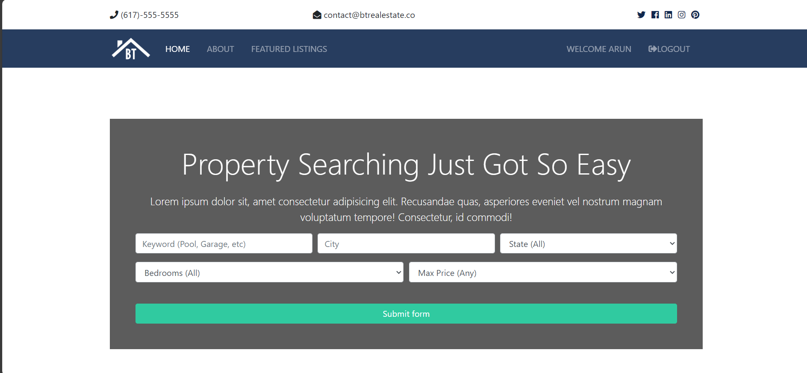
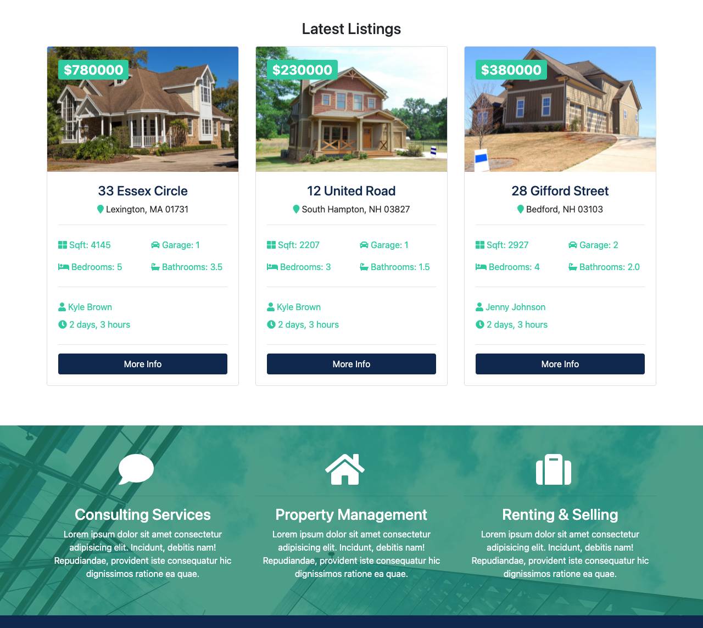

# BTRE Project

The **BTRE Project** is a real estate website built during Brad Traversy's online course. The platform serves the fictional **BT Real Estate** company and focuses on implementing key backend functionalities. The design templates for the site are premade and use the Bootstrap framework to enhance the user interface.

---

## Key Features

- **Seller of the Month**: Dynamically showcases the top seller of the month based on performance metrics.
- **Advanced Property Search**: Users can search for properties by various criteria such as location, price, and features.
- **Property Inquiries**: Interested users can submit inquiries about a property using the contact form, no login required.
- **User Dashboard**: Registered users have access to a personalized dashboard where they can view their past inquiries and account details.
- **Admin Dashboard**: Admin users have a customized control panel to manage properties, inquiries, and users.
- **PostgreSQL Database**: The application uses a PostgreSQL database to store all data related to properties, users, and inquiries, with access control for admins and staff.
- **Role-Based Authentication**: The platform supports different user roles such as staff, realtors, and admin, each with specific permissions.

---

## Screenshots

### Home Page



### Property Listings



---

## Installation

To run the BTRE project locally, follow these steps.

### Prerequisites

Ensure that the following are installed on your system:

- Python 3.x
- PostgreSQL
- pip (Python package manager)
- Virtualenv (recommended)

### Clone the Repository

Start by cloning the repository to your local machine:

```bash
git clone https://github.com/your-username/btre-project.git
cd btre-project
